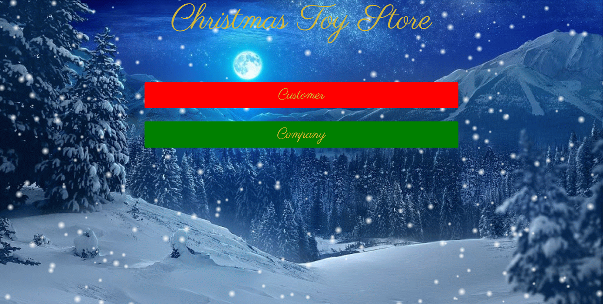

# ToyYoda!

[Check the app](https://fathomless-reef-78456.herokuapp.com/)

## Project Brief

A UI(User Interface) site that was developed for both an internal company ERP(Enterprise Resource Planning) system and an external public website.

### MVP:

#### Company Page:

1. A company employee can add or update an inventory (toy) record in the database.

2. Once an inventory is added, it will render designated page for each inventory with all information related to it.

3. The Company page will also have a Order Table which will show records of all purchase history with time stamp.

#### Customer Page:

1. A customer will be asked 5 questions related to their children's character which will then match them with 3 most closest recommended toys.

2. Customers' preference will be stored and they will be recommended for toys based on their previously taken survey scores until they retake the survey. (**Note:** *Customer's survey scores are stored instead of their recommended toys. Hence, a customer may see different recommendation if the Toy Inventory is updated with new toys!*).

3. A customer can purchase a certain recommended toy by clicking it and print out a receipt.

## Technologies Used: 
  
  * [express](https://www.npmjs.com/package/express)
  * [sequelize](https://www.npmjs.com/package/sequelize)
  * [passport](http://www.passportjs.org)
  * [express handlebars](https://www.npmjs.com/package/express-handlebars)
  * [Node MySQL2](https://www.npmjs.com/package/mysql2)
  * [bcrypt-nodejs](https://www.npmjs.com/package/bcrypt-nodejs)

